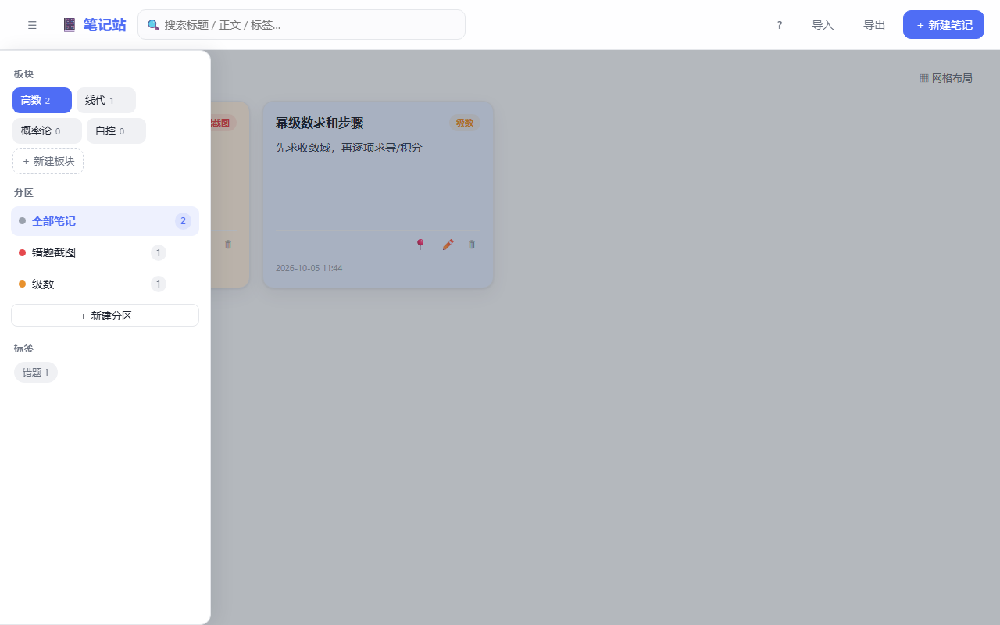
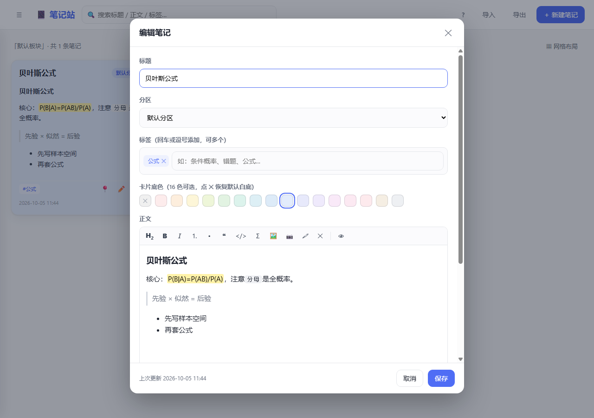
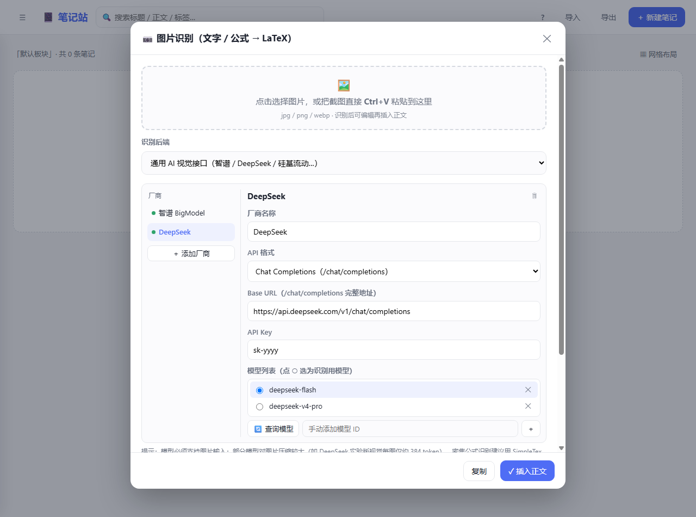

# 📔 笔记站

单文件、离线优先的本地笔记应用 —— 一个 `index.html` 双击即用，无需安装、无服务端、数据全在本机。特别适合考研/课程笔记：板块化管理、公式渲染、截图转 LaTeX。



## ✨ 特性

- **多板块**：高数 / 线代 / 概率论 / 自控……自由添加；每个板块就是一页，分区、标签、笔记完全隔离
- **分区 + 标签**：板块下自建分区（可整区跨板块搬移），笔记多标签一键筛选
- **富文本编辑器**：`H₂` 标题 / 加粗 / 斜体 / 列表 / 引用 / 行内代码 / Σ 公式 / 图片 / 高亮工具栏 + 👁 预览；**粘贴 Markdown 原文自动转排版**、**粘贴截图直接进图片列表**，编辑区可拖拽调高
- **公式渲染**：MathJax 驱动，行内 `$...$`、独立 `$$...$$`
- **卡片底色**：16 种柔和底色，卡片一眼分类
- **📷 图片识别（OCR）**：教材/笔记截图 Ctrl+V → 文字+公式一起转成 LaTeX，可改后一键插入；厂商管理器内置 **18 家预设**（DeepSeek / 智谱 / 硅基流动 / 通义 / 豆包 / Kimi / OpenAI / Anthropic / Gemini / Groq / OpenRouter……），API 格式支持 **Chat Completions / Anthropic Messages / Responses**，填好 Key 点「查询模型」自动拉取可用模型列表
- **自由布局**：卡片拖拽、边缘缩放，自动防重叠，「整理布局」一键散开
- **搜索 / 备份**：标题·正文·标签全文搜索；导出含图片的 JSON 备份，导入即恢复
- **内置自检**：地址栏加 `?selftest=1` 运行 119 项自动测试

## 🚀 快速开始

1. 下载 [`index.html`](index.html)
2. 双击用浏览器打开（推荐 Chrome / Edge）
3. 开始记笔记 —— 数据自动保存在浏览器本地

也可以把仓库发布到 GitHub Pages / Vercel 等静态托管，在线访问同一份文件。

### 📷 OCR 识别配置

1. 正文编辑器工具栏点 **📷**
2. 「＋ 添加厂商」从预设选择（默认 **DeepSeek**，已填好官方地址），粘贴 API Key
3. 点 **「查询模型」** 拉取该 Key 可用的真实模型列表，○ 选中一个支持图片输入的模型
4. 截图后 Ctrl+V → 识别 → 修改 → 「插入正文」

> - API Key 只保存在本机浏览器，任何请求都由浏览器直接发往对应厂商，无中间服务器
> - 个别模型对图片压缩较大（如 DeepSeek 实验版视觉每图约 384 token），整页密集公式建议选高分辨率视觉模型或 SimpleTex

## 💾 数据与隐私

- 笔记存 localStorage，图片存 IndexedDB，OCR 配置存本机 —— **没有任何服务端**
- 右上角「导出」生成含图片的 JSON 备份；换设备/换浏览器用「导入」恢复
- 清理浏览器数据会清空笔记，请养成定期导出的习惯

## 🖼 更多截图

| 编辑器 | OCR 厂商管理器 |
| --- | --- |
|  |  |

## 📁 目录结构

```
├── index.html    # 全部功能都在这一个文件
├── docs/         # 截图
└── README.md
```

## 许可

仅供个人学习使用，欢迎修改与分享。
